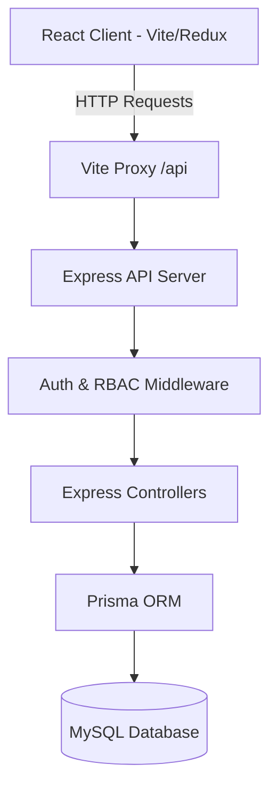

# School ERP System Documentation

Welcome to the **Vantage School ERP** system documentation. This document explains the purpose, architecture, core features, and technical workflows of the application.

---

## 1. Project Overview & Use Cases

This project is a multi-tenant **School Enterprise Resource Planning (ERP)** system. It is designed to digitize and manage the daily operations of educational institutions. 

### What is it used for?
1. **Multi-School Management (Super Admin):** Allows hosting multiple independent schools (tenants) on a single server, setting licensing constraints, and enabling/disabling modules per school.
2. **Student & Parent Administration:** Tracks the complete student lifecycle from admission inquiries, application reviews, enrolment, promotion, to archive records.
3. **Academic Structure Setup:** Configures classes, sections, subjects, and timetables.
4. **Attendance Tracking:** Digitizes daily registers and attendance percentages for students.
5. **Fee Collection & Finance:** Manages class-wise fee structures and processes/receipts fee collections.
6. **Exams & Report Cards:** Coordinates exam schedules, marks entries, and aggregates reports cards.
7. **Communication portal:** Distributes circulars and announcements (notices) to specific audiences (teachers, parents, students).

---

## 2. Technical Architecture & Tech Stack

The application is built using a modern **Monorepo-style Client-Server Architecture** using TypeScript.

### Technology Stack
* **Frontend:** React 19, Vite, Redux Toolkit (State Management), React Router v7, Tailwind CSS v4, Lucide React (Icons).
* **Backend:** Node.js, Express, TypeScript, Prisma ORM, JSON Web Tokens (JWT) for authentication, BcryptJS for password hashing.
* **Database:** MySQL.

---

## 3. Core Modules & Workflows

### A. Authentication & Multitenancy (How it works under the hood)
* **Authentication:** Uses JWT-based authorization. When logging in, the server generates an `accessToken` (7-day expiry) and a `refreshToken` (30-day expiry).
* **Data Isolation (Multitenancy):** 
  * Each school has a unique `schoolId`. 
  * Every record in the database (Student, Teacher, Class, etc.) is mapped to a `schoolId`.
  * The server uses a utility [schoolScope.ts](file:///d:/practise/ERP/server/src/utils/schoolScope.ts) to intercept requests. If the logged-in user is an admin or teacher, database queries are automatically filtered to include `{ schoolId: user.schoolId }`. 
  * Super Admins can pass an `x-school-id` header to swap their dashboard context and manage individual schools.

### B. Student Enrolment Flow
1. **Enquiry:** Prospective parent submits an enquiry.
2. **Admission Application:** An application is created under a specific Class and Academic Year.
3. **Conversion to Student:** The admin approves the application by calling `convertAdmissionToStudent`.
   - Creating a `Parent` record and associated login account.
   - Creating a `Student` record and associated login account (using default password `Student@123`).
   - Automatically querying active `FeeStructure` rules for that class and assigning them to the student.

### C. Fee & Payment Flow
1. **Fee Structures:** Admins create class-wide fee rules (e.g. Tuition Fee: ₹15,000, Exam Fee: ₹1,000).
2. **Student Fee Assignment:** When students enroll or are promoted, these fee rules are assigned to them in the `StudentFee` table. Custom overrides are supported.
3. **Collecting Fees:** Clerks/Admins log payments. The payment decreases the student's `balanceDue` calculated by:
   $$\text{Balance Due} = \text{Total Assigned Fees} - \text{Total Payments Made}$$
4. **Receipt Generation:** Every payment generates a unique, incremented receipt number (e.g., `RCP-2026-00001`) that can be printed by parents/admins.

### D. Academic Promotion Flow
At the end of an academic session, students are promoted to the next grade:
1. Outstanding balances on their current ledger are calculated.
2. Existing fee assignments for the completed year are closed.
3. The student's class and section are updated to the target grade, and their active academic year transitions.
4. Class fees for the new year are assigned, and any outstanding balance is rolled over as a **"Previous Dues"** fee structure.

### E. Exams & Marks Submission
1. Admins schedule exams for specific classes.
2. Teachers select the exam and subject to submit grades/marks for all students in that class.
3. The system generates report cards compiling marks, percentages, grades, and teacher remarks.

---

## 4. Default Credentials (Local Setup)

* **Super Admin Login:**
  * **Email:** `admin@school.com`
  * **Password:** `Admin@123`
* **Default Student Password:** `Student@123`
