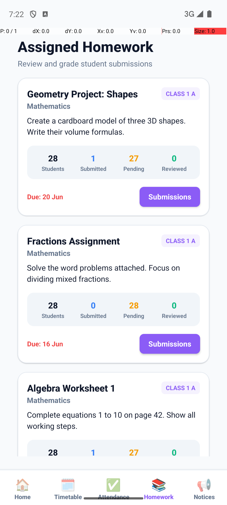
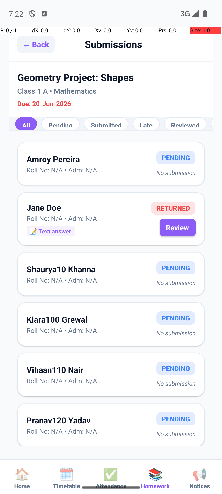
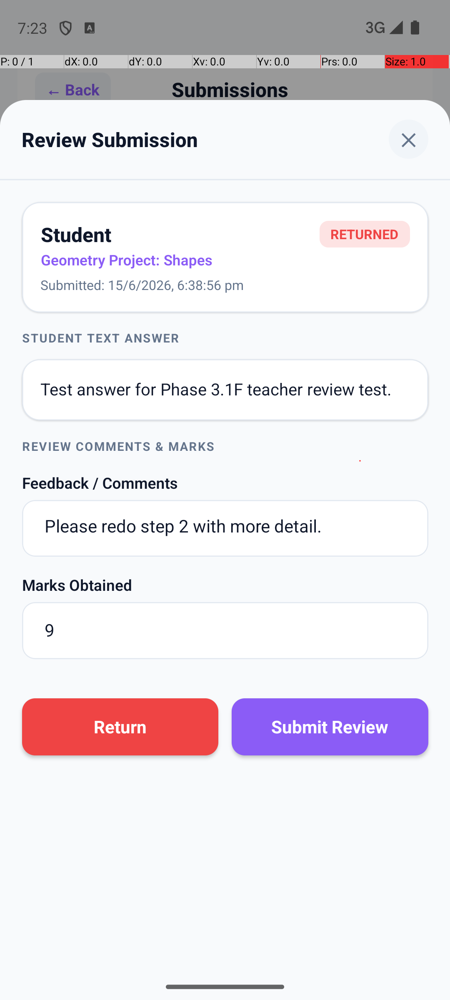
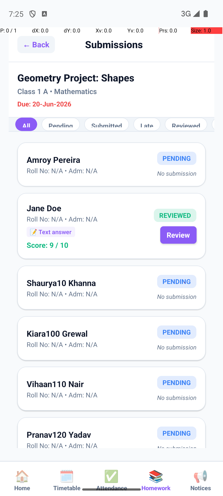

# Phase 3.1G Audit: Teacher Homework Review Mobile UI

**Implementation commit:** `b9bbc8efa14165b162982f40b22032ff06db77d0`
**Audit date:** 2026-06-15
**Branch:** `Nupun`

---

## Audit Summary

| Check | Result |
|---|---|
| Git branch | ✅ `Nupun` |
| Implementation commit | ✅ `b9bbc8e` |
| Mobile typecheck (`npx tsc --noEmit`) | ✅ 0 errors |
| Server typecheck (`npx tsc --noEmit`) | ✅ 0 errors |
| Client typecheck (`npx tsc --noEmit`) | ✅ 0 errors |
| Backend regression tests | ✅ 26 / 26 passed |
| Runtime screenshots (real emulator) | ✅ 5 captured |
| Accidentally committed unrelated files | ✅ None (audited) |
| `.gitignore` updated for dev artefacts | ✅ Yes |

---

## Commit File Audit

Files in commit `b9bbc8e`:

| File | Status |
|---|---|
| `mobile/app.json` | ✅ Required — adds `expo-sharing` to Expo plugin list (needed for native module linking) |
| `mobile/package-lock.json` | ✅ Required — reflects `expo-sharing` and `expo-file-system` install |
| `mobile/package.json` | ✅ Required — declares `expo-sharing` and `expo-file-system` dependencies |
| `mobile/src/api/mobileApi.ts` | ✅ Required — adds 5 teacher homework API functions |
| `mobile/src/navigation/TeacherNavigator.tsx` | ✅ Required — adds Homework tab |
| `mobile/src/screens/teacher/TeacherHomeworkScreen.tsx` | ✅ Required — new screen |
| `mobile/src/screens/teacher/components/HomeworkReviewModal.tsx` | ✅ Required — new component |
| `mobile/src/screens/teacher/components/TeacherHomeworkSubmissionsView.tsx` | ✅ Required — new component |
| `mobile/src/types/mobile.types.ts` | ✅ Required — new type definitions |
| `test-results/phase-3-1g-*/…` | ✅ Required — audit evidence notes and test results |

**No accidentally committed unrelated files found.**

---

## Runtime Verification Screenshots

All screenshots are real emulator captures taken via `adb shell screencap`.

### 1. Assigned Homework List
Shows teacher's homework list with submission stats (Students / Submitted / Pending / Reviewed) per homework card.



---

### 2. Submissions List View
Shows all student submissions for "Geometry Project: Shapes" with filter tabs (All / Pending / Submitted / Late / Reviewed / Returned) and per-student status badges.



---

### 3. Submission Detail (Review Modal open)
Review Submission modal with student text answer, feedback input, marks input, Return and Submit Review buttons.



---

### 4. Review Modal (with data filled)
Modal pre-filled with existing feedback ("Please redo step 2 with more detail.") and marks (9) for a RETURNED submission.


---

### 5. Post-Review Submission List (Reviewed status updated)
After submitting the review, Jane Doe's status updated to REVIEWED and score "9 / 10" is shown inline.



---

## Confirmed Bugs Found & Fixed

| Bug | Fix |
|---|---|
| `expo-sharing` native module not linked (crash on first launch) | Ran `npm run android` clean rebuild to link native module |
| `test-screen.png`, `window_dump.xml`, `server/request-log.txt`, `server/audit_output.txt` untracked dev artefacts | Added to `.gitignore` in audit commit |

---

## Backend Regression Tests (26/26)

```
RESULTS: 26 passed, 0 failed
TEACHER HOMEWORK REVIEW BACKEND TESTS PASSED SUCCESSFULLY
```

All security checks passed:
- Student → teacher endpoints: BLOCKED (403)
- Parent → teacher endpoints: BLOCKED (403)
- Unauthenticated requests: BLOCKED (401)
- Negative marks: rejected (400)
- Invalid status values: rejected (400)
- IDOR fabricated homework ID: BLOCKED (404)
- IDOR fabricated submission ID: BLOCKED (404)
