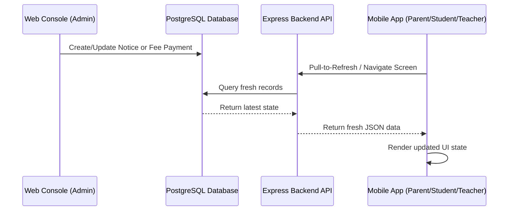

# Phase 3.2G Web-Mobile Sync Notes

## Sync Architecture
Sync between the Web console and Mobile app in Vantage ERP relies on a direct database synchronization model:
- **Write Actions**: Admin/Clerk actions on the Web console (like assigning a fee structure, collecting a payment, or publishing a notice) are written to the central PostgreSQL database immediately.
- **Fetch Actions**: The Mobile app calls the Express REST API endpoints which query the active PostgreSQL database directly via Prisma ORM.

---

## Refresh Behaviors and Caching
- **Pull-to-Refresh**: Both `ParentFeesScreen` and `ParentNoticesScreen` use React Native `RefreshControl` tied to their API fetch hooks. Pulling down on the screen triggers a fresh HTTP GET request to the backend.
- **Screen Focus**: Core mobile navigators trigger data reloading on screen focus (`useCallback` and screen hooks), ensuring navigation between tabs loads the most up-to-date data.
- **Client Caching**: There is **no persistent offline client caching** implemented for Fees or Notices in the mobile app. This ensures that users always see accurate billing ledgers and urgent notices without synchronization delay or cache invalidation lag.
- **Latency**: Network synchronization is bounded only by standard HTTP round-trip time. Over local/development networks, updates are visible in less than 200ms upon pull-to-refresh.
