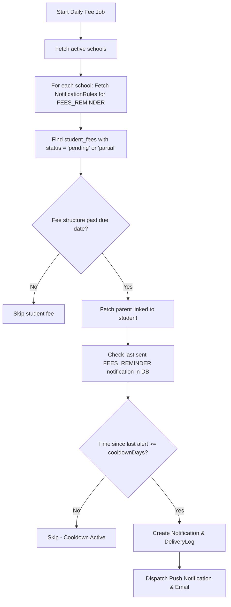

# Scheduler and Reminder Job Plan - Phase 4.1

This document describes the design and logic flow for background jobs that automate periodic alerts and reminders (such as overdue fees and repeated absence alerts).

---

## 1. Background Job Architecture

We propose using a standard lightweight Node-cron or a Redis/BullMQ task runner integrated within the Express server process (configured to run only on a single worker node if clustered).

### Active Jobs Settings

| Task Name | Cron Schedule | Responsibility | Trigger Module |
| :--- | :--- | :--- | :--- |
| `feeOverdueReminderJob` | `0 8 * * *` (Daily at 8:00 AM) | Find overdue student fees and dispatch reminders to parents with cooldown checks. | Fee Reminder |
| `absenceAlertScannerJob` | `0 18 * * *` (Daily at 6:00 PM) | Fallback scanner to catch students who crossed absence thresholds today (if not caught during attendance submission). | Attendance |

---

## 2. Fee Overdue Reminder Job Logic Flow

Every day at 8:00 AM, the job executes the following logic sequence:



### Cooldown SQL Query Example
Before issuing a reminder, the service runs a check equivalent to:
```sql
SELECT MAX(createdAt) as lastSent
FROM notifications
WHERE recipientUserId = :parentUserId
  AND studentId = :studentId
  AND relatedEntityType = 'fee'
  AND relatedEntityId = :feeStructureId
  AND type IN ('FEES_OVERDUE', 'FEES_REMINDER');
```
If `lastSent` is not null and `now - lastSent < cooldownHours`, the reminder is skipped.

---

## 3. Absence Alert Job Logic Flow

Absence scanning can run immediately post-attendance submission, or as a nightly scan to guarantee audit coverage:

1. **Query Absences**: Fetch attendance records within the sliding threshold window (e.g., 7 days or 30 days) where status is `'absent'`.
2. **Evaluate Threshold**:
   * For the 7-day window: count absences. If count $\ge$ 3, flag student.
   * For the 30-day window: count absences. If count $\ge$ 5, flag student.
3. **Evaluate Cooldown**:
   * Query database for an existing `ATTENDANCE_ABSENCE_ALERT` notification for that student and parent within the cooldown window (e.g., last 48 hours).
4. **Action**: If threshold is crossed and cooldown is cleared, insert a new notification record and send push notifications to parents.
